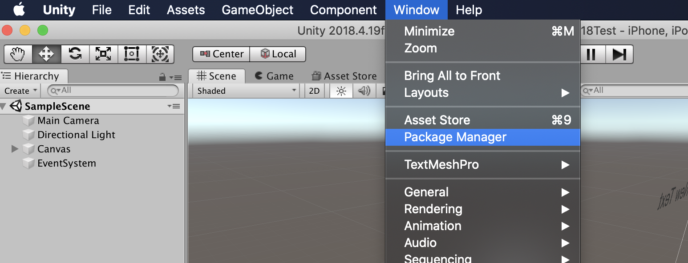
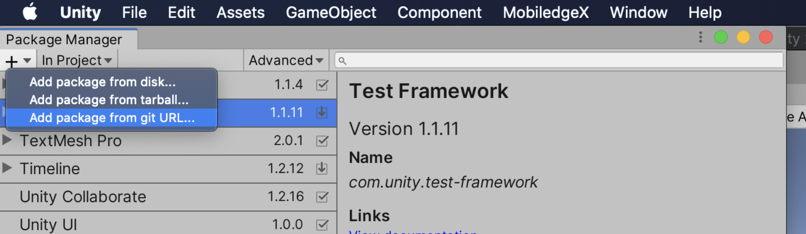
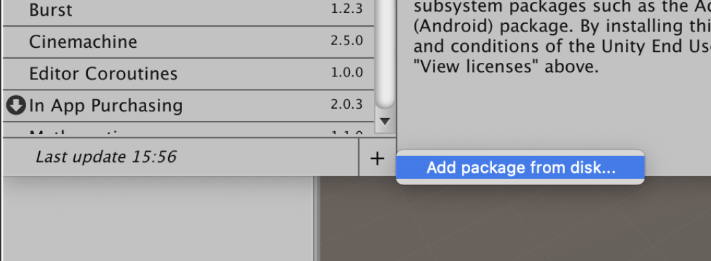
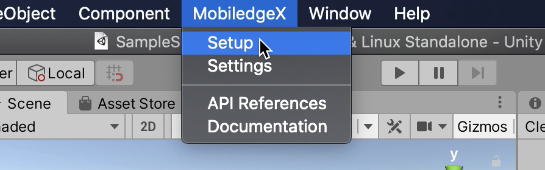
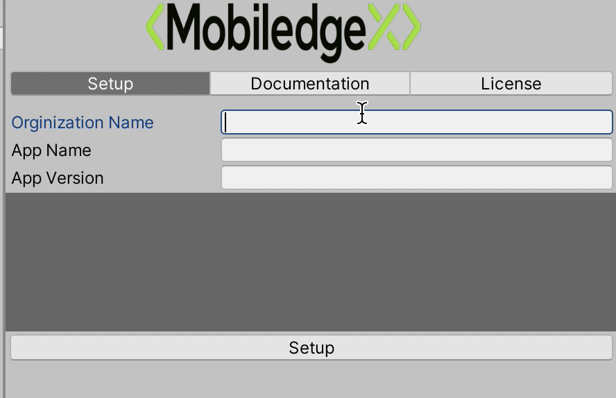

<p align="center">
  

  <h3 align="center">MobiledgeX Unity SDK</h3>

  <p align="center">
  Add Edge Computing to your Unity Games and Applications.
    <br />
    <a href="https://developers.mobiledgex.com/sdk-libraries/unity-sdk"><strong>Explore the docs »</strong></a>
    <br />
    <br />
    <a href="https://github.com/mobiledgex/edge-cloud-sampleapps">View Edge Sample Apps</a>
    ·
    <a href="https://github.com/mobiledgex/edge-cloud-sdk-unity/issues/new">Report Bug</a>
    ·
    <a href="https://github.com/mobiledgex/edge-cloud-sdk-unity/issues/new">Request Feature</a>
  </p>
</p>


<!-- TABLE OF CONTENTS -->
## Table of Contents

* [Getting Started](#getting-started)
  * [Prerequisites](#prerequisites)
  * [Installation](#installation)
* [Usage](#usage)
* [Roadmap](#roadmap)
* [Contributing](#contributing)
* [License](#license)
* [Contact](#contact)
* [Acknowledgements](#acknowledgements)


<!-- GETTING STARTED -->
## Getting Started
MobiledgeX Inc. is building a marketplace of edge resources and services that will connect developers with the world’s largest mobile networks to power the next generation of applications and devices. MobiledgeX is an edge computing company founded by Deutsche Telekom AG and headquartered in San Francisco, California.

The MobiledgeX Unity SDK enables an application to register and then locate the nearest edge cloudlet backend server for use. The SDK also allows verification of a device's location for all location-specific tasks. Because these APIs involve networking, most functions will run asynchronously, and in a background thread.

### Prerequisites

This SDK works on Unity Editor 2018.4.19f1 (LTS) and higher.


### Installation

1. Create an Account on MobiledgeX Console [https://console.mobiledgex.net](https://console.mobiledgex.net)
2. Upload your server/backend to MobiledgeX Console using(github actions/ MobiledgeX Console) 
3. Add the UnitySDK using Unity Package Manager

 

For **Unity 2019 and later** you can add the package through git url


  
If you have **Unity 2018**:

a. Clone the repo.

b. Open Unity Package Manager.

c. Select Add Package from disk. (see the image) 

d. Browse to **(MobiledgeX/package.json)** and double click it.

 


4. Configure MobiledgeX Settings in the editor
 Open MobiledgeX Setup Window 
  
(Enter Organization Name, Application Name, Application Version) and press Setup
  

5. Once you get the message **"Connected, you are all set! "**, Congrats you have got MobilegdeX SDK integrated in your project.

**If you are using version control (ex. github) make sure not to exclude the project meta files or at least not to exclude the MobiledgeX SDK meta files**


<!-- USAGE EXAMPLES -->
## Usage

```
using MobiledgeX;
using System.Threading.Tasks;
```


For Restful Connection

` string url = await MobiledgeXIntegration.GetURI();`


For Websocket Connection

```
    // Create an instance of MobiledgeXIntegration
    MobiledgeXIntegration integration = new MobiledgeXIntegration();
    // Create an instance of MobiledgeXSocketClient
    MobiledgeXSocketClient client;
    // Start a websocket using an instance of MobiledgeXSocketClient
    async void StartWebSocket()
    {
        client = new MobiledgeXSocketClient(integration);
        if (client.isOpen())
        {
            client.Dispose();
            client = new MobiledgeXSocketClient(integration);
        }
       // supply your query parameters 
       await wsClient.Connect("parameter=x");
        wsClient.Send("msg");
    }
    
    // Check wsClient 
    private void Update()
    {
        if (wsClient == null)
        {
            return;
        }
        var cqueue = wsClient.receiveQueue;
        string msg;
        while (cqueue.TryPeek(out msg))
        {
            cqueue.TryDequeue(out msg);
            print(msg);
        }
    }
```


_For more examples, please refer to the [Edge Sample Apps](https://github.com/mobiledgex/edge-cloud-sampleapps/)_


<!-- ROADMAP -->
## Roadmap

Add or See the [open issues](https://github.com/mobiledgex/edge-cloud-sdk-unity/issues) for a list of proposed features (and known issues).


<!-- CONTRIBUTING -->
## Contributing

Contributions are what make the open source community such an amazing place to be learn, inspire, and create. Any contributions you make are **greatly appreciated**.

1. Fork the Project
2. Create your Feature Branch (`git checkout -b feature/AmazingFeature`)
3. Commit your Changes (`git commit -m 'Add some AmazingFeature'`)
4. Push to the Branch (`git push origin feature/AmazingFeature`)
5. Open a Pull Request


<!-- LICENSE -->
## License


<!-- CONTACT -->
## Contact


<!-- ACKNOWLEDGEMENTS -->
## Acknowledgements
